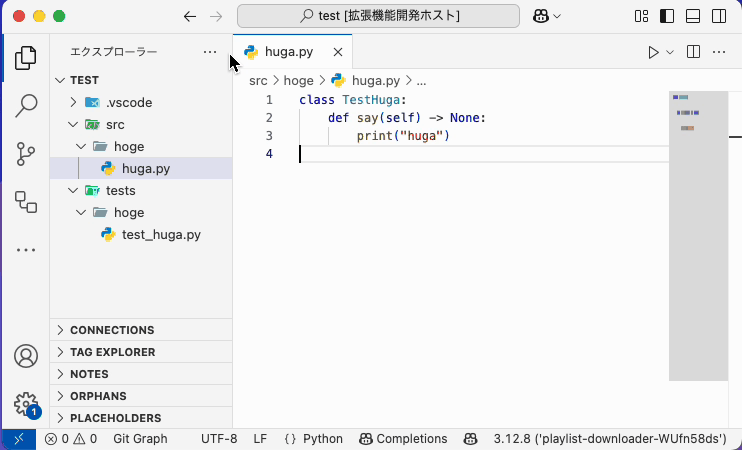
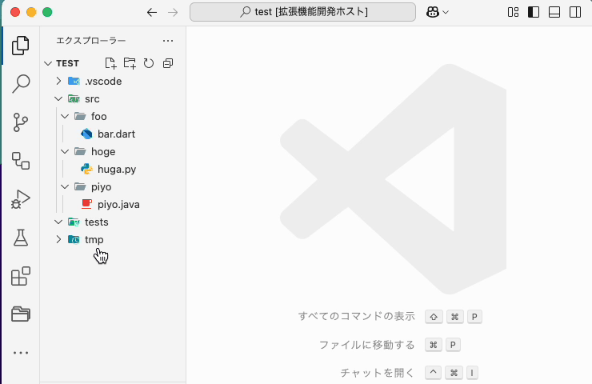
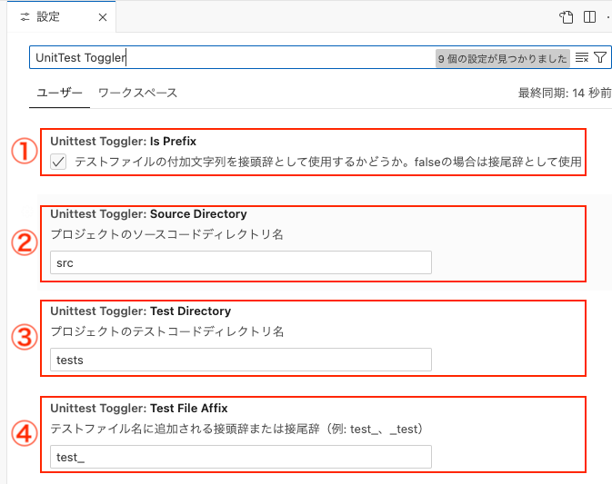

# UnitTest Toggler

This extension allows you to easily toggle between module files and unittest files in VS Code. \
(VSCode上でモジュールファイルとunittestファイルを簡単に切り替えるための拡張機能です。)

## Features / How to Use (機能 / 使い方)

### Easy switching between module files and test files
- 
- Press `Ctrl+Shift+T` (macOS: `Cmd+Shift+T`)
- Command-palette to `Toggle UnitTest`
- Right-click to `Toggle UnitTest`

### Automatic generation of non-existent test files
- 
- If test-file does not exist, create it!
- If module-file does not exist, create it!
- If folder does not exist, create it!

### Batch generation of test files for multiple source files
- 
- Support for various programming languages

### Customizable settings to match your project structure
- 

## Setting Examples (設定例)
### vscode settings(Ctrl + ,)
- 
1. `unittestToggler.isPrefix`: Whether to use the affix as a prefix (default: `true`)
   - `true`: Format like `test_sample.py`
   - `false`: Format like `sample_test.py`
2. `unittestToggler.sourceDirectory`: Name of your project's source code directory (default: `src`)
3. `unittestToggler.testDirectory`: Name of your project's test code directory (default: `tests`)
4. `unittestToggler.testFileAffix`: Prefix or suffix added to test file names (default: `test_`)

### settings.json
You can add settings like the following to your `settings.json`:

```json
{
  "unittestToggler.sourceDirectory": "src",
  "unittestToggler.testDirectory": "test",
  "unittestToggler.testFileAffix": "_test",
  "unittestToggler.isPrefix": false
}
```
- Source file: `src/hoge/huga.ts`
- Test file: `test/hoge/huga_test.ts`

## Requirements

- Visual Studio Code version 1.100.0 or later

## Release Notes

### 0.0.1

- Initial release
- Module and test file toggle feature
- Test file auto-generation feature
- Batch file generation feature
- Settings customization feature

## License

MIT

**Enjoy TDD!**
