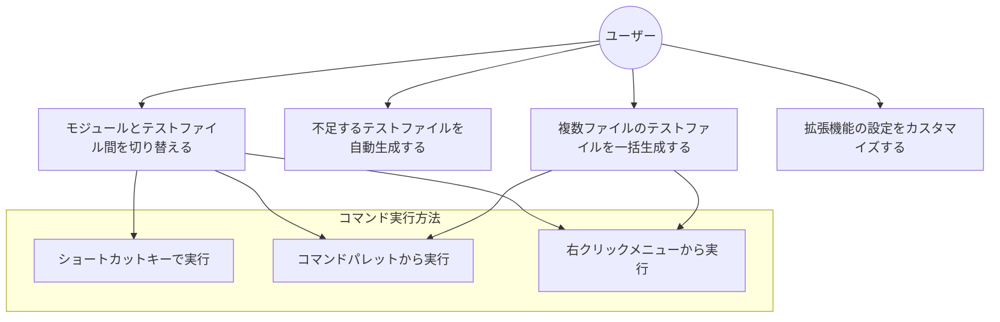
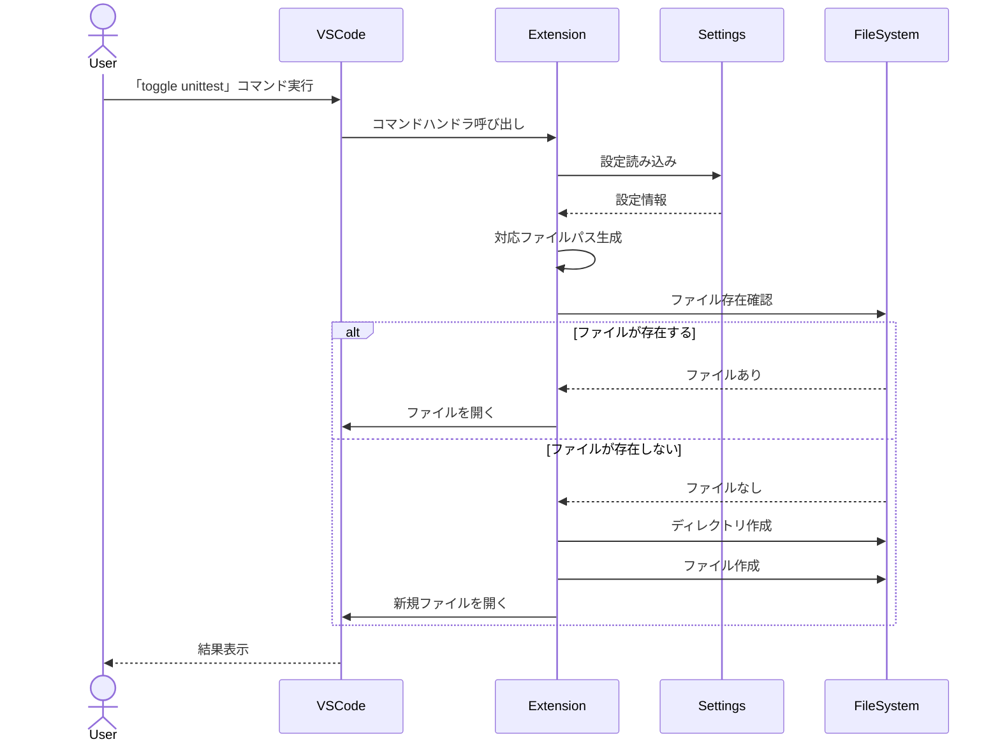
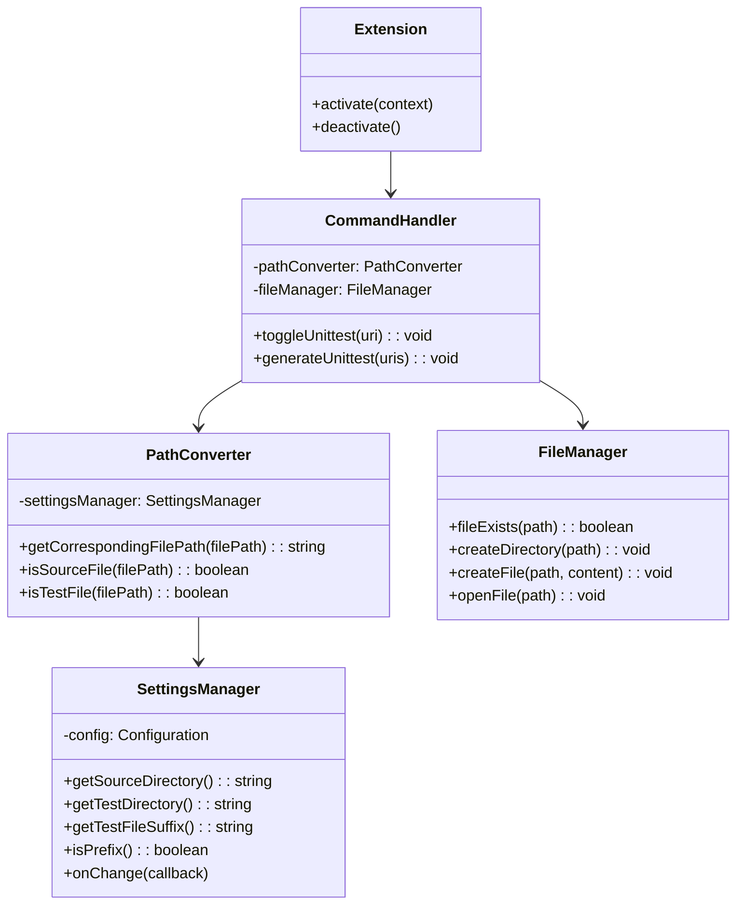

# Issue945の仕様書

## 1. 目次
- [1. 目次](#1-目次)
- [2. 用語](#2-用語)
- [3. 依頼内容](#3-依頼内容)
- [4. 機能要件/非機能要件](#4-機能要件非機能要件)
  - [4.1. 機能要件](#41-機能要件)
  - [4.2. 非機能要件](#42-非機能要件)
- [5. 使用ツール/ライブラリ](#5-使用ツールライブラリ)
- [6. アーキテクチャ設計](#6-アーキテクチャ設計)
  - [6.1. 全体構成](#61-全体構成)
  - [6.2. 主要コンポーネント](#62-主要コンポーネント)
- [7. UML](#7-uml)
  - [ユースケース図](#ユースケース図)
  - [7.1. シーケンス図](#71-シーケンス図)
  - [7.2. クラス図](#72-クラス図)
- [8. タスク](#8-タスク)

## 2. 用語
- モジュールファイル: 実装対象のソースコードファイル（例: `hoge.py`）
- テストファイル（unittestファイル）: 対応するテストコードを含むファイル（例: `test_hoge.py`）
- トグル: モジュールファイルとテストファイルを相互に切り替える操作
- VSCode: Visual Studio Code エディタ

## 3. 依頼内容
- issue番号: 945
- タイトル: VSCode上でモジュールファイルとunittestファイルを切り替えできる拡張機能の開発の要件定義
- 内容: 
  - VSCode上でモジュールファイルとunittestファイルを簡単に作成・切り替えできる拡張機能を開発する
  - 各種言語に対応し、プロジェクト構成に合わせて設定可能なものとする
  - ショートカットキーやコマンドパレット、コンテキストメニューから操作可能なものとする

## 4. 機能要件/非機能要件
### 4.1. 機能要件
- VSCode拡張機能としてパッケージング・リリースできること
- 任意のプログラミング言語（ファイル拡張子）に対応すること
- 以下のいずれの方法でもコマンドが実行できること
  - ショートカットキー
  - コマンドパレット（Ctrl + Shift + P）
  - ファイル上で右クリックしたコンテキストメニュー
- ワークスペースレベルまたはフォルダレベルのsetting.jsonで以下の項目を設定できること
  - プロジェクトのソースディレクトリ（srcディレクトリ）
  - プロジェクトのテストディレクトリ（testsディレクトリ）
  - テストファイルの付加文字列（例: `_test`, `test_`）
  - 文字列を接頭辞とするか接尾辞とするか（isPrefix）
- 通常の設定画面（Ctrl + .）からGUI上でも上記設定が可能なこと
- モジュールファイル上でコマンド「toggle unittest」を実行するとテストファイルを開くこと
  - テストファイルが存在しない場合は自動で生成すること
  - ファイルへの経路のフォルダが存在しない場合も自動で生成すること
  - モジュールファイルと同様のフォルダ構成の場所をテストファイルの配置先として使用すること
- テストファイル上でコマンド「toggle unittest」を実行するとモジュールファイルを開くこと
- VSCodeのファイルエクスプローラー上でファイルを選択して「generate unittest」コマンドを実行すると、対応するテストファイルを自動生成できること
  - 選択したファイルが設定したディレクトリ外の場合はエラーを表示すること

### 4.2. 非機能要件
- 動作が軽快であること（トグル操作はほぼ即時に完了すること）
- メモリ使用量が少ないこと（VSCodeの動作に影響を与えないこと）
- リリース後も容易にメンテナンスできる構造であること

## 5. 使用ツール/ライブラリ
- Node.js
- TypeScript
- VS Code Extension API
- npm / yarn（パッケージ管理）
- vsce（VS Code Extension パッケージング）
- jest（テスト用）

## 6. アーキテクチャ設計
### 6.1. 全体構成
- 拡張機能は以下の主要コンポーネントで構成されます：
  - エントリーポイント（メインモジュール）
  - コマンドハンドラー
  - ファイルシステム操作
  - 設定管理
  - ユーザーインターフェース

### 6.2. 主要コンポーネント
#### 6.2.1. 設定管理コンポーネント
- **目的**: ユーザー設定の読み込みと管理
- **機能**:
  - ワークスペース/フォルダレベルの設定読み込み
  - デフォルト設定の提供
  - 設定変更の検出と反映

#### 6.2.2. ファイルパス解析コンポーネント
- **目的**: モジュールファイルとテストファイル間のパス変換
- **機能**:
  - ファイルパスの解析
  - 対応するファイルパスの生成
  - ディレクトリ構造の検証

#### 6.2.3. ファイル操作コンポーネント
- **目的**: ファイルの生成と操作
- **機能**:
  - ファイルの存在確認
  - ディレクトリの生成
  - ファイルの生成
  - ファイルのオープン

#### 6.2.4. コマンドハンドラコンポーネント
- **目的**: 拡張機能のコマンド実装
- **機能**:
  - `toggle unittest`コマンドの処理
  - `generate unittest`コマンドの処理
  - エラーハンドリング

#### 6.2.5. UI通知コンポーネント
- **目的**: ユーザーへのフィードバック提供
- **機能**:
  - 成功通知の表示
  - エラー通知の表示
  - 確認ダイアログの表示

## 7. UML
### ユースケース図

### 7.1. シーケンス図

### 7.2. クラス図

## 8. タスク
- 合計工数: 20h
- [ ] 開発環境のセットアップ (2h)
  - [ ] VSCode拡張機能開発用プロジェクトの初期化 (1h)
    - Node.jsとTypeScriptのセットアップ
    - 必要なパッケージのインストール
    - 拡張機能のマニフェスト作成
  - [ ] 開発用構成の設定 (1h)
    - デバッグ設定の構成
    - テスト環境の構築

- [ ] 設定機能の実装 (3h)
  - [ ] 設定スキーマの定義 (1h)
    - 設定項目の定義（ソースディレクトリ、テストディレクトリ、テストファイル接頭辞/接尾辞など）
    - デフォルト値の設定
  - [ ] 設定管理クラスの実装 (2h)
    - 設定の読み込み機能
    - 設定変更の監視機能
    - 設定のバリデーション機能

- [ ] パス変換ロジックの実装 (4h)
  - [ ] ファイルパス解析機能の実装 (2h)
    - ファイルタイプの判定（モジュールファイル/テストファイル）
    - ファイルパスからディレクトリ情報の抽出
  - [ ] パス変換機能の実装 (2h)
    - モジュールファイルからテストファイルへのパス変換
    - テストファイルからモジュールファイルへのパス変換
    - ディレクトリ構造の考慮

- [ ] ファイル操作機能の実装 (3h)
  - [ ] ファイル存在確認機能の実装 (1h)
    - 指定パスのファイル存在チェック
  - [ ] ディレクトリ・ファイル作成機能の実装 (2h)
    - 再帰的なディレクトリ作成
    - 空ファイルの作成
    - 基本的なテンプレートの適用

- [ ] コマンド実装 (4h)
  - [ ] 「toggle unittest」コマンドの実装 (2h)
    - 現在アクティブなファイルの取得
    - 対応するファイルへの切り替え処理
    - エラーハンドリング
  - [ ] 「generate unittest」コマンドの実装 (2h)
    - 選択ファイルの取得
    - 対応するテストファイルの生成
    - 複数ファイル選択時の処理

- [ ] ユーザーインターフェースの実装 (2h)
  - [ ] コマンドパレットへの登録 (0.5h)
    - コマンド表示名の設定
  - [ ] コンテキストメニューへの追加 (0.5h)
    - メニュー項目の設定
  - [ ] キーボードショートカットの設定 (0.5h)
    - デフォルトショートカットの設定
  - [ ] ステータス通知の実装 (0.5h)
    - 成功/失敗メッセージの表示

- [ ] テストの実装 (2h)
  - [ ] 単体テストの実装 (1h)
    - 各コンポーネントの機能テスト
  - [ ] 統合テストの実装 (1h)
    - 一連の操作フローのテスト

- [ ] パッケージング・リリース準備 (2h)
  - [ ] ドキュメント作成 (1h)
    - README.mdの作成
    - 使い方の説明
  - [ ] パッケージング設定 (1h)
    - VSCEによるパッケージング
    - マーケットプレイス公開準備
