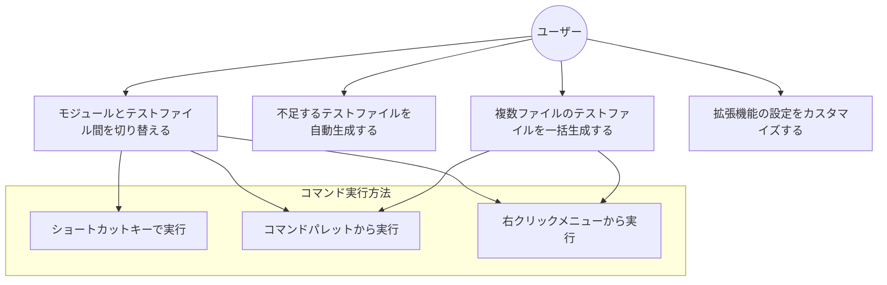
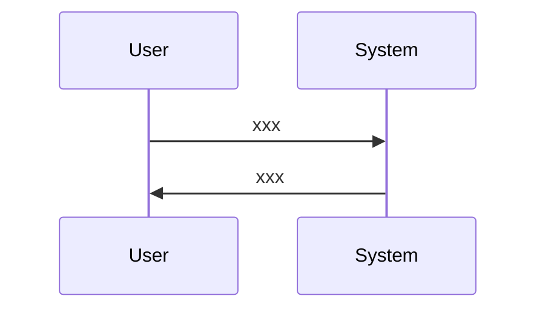
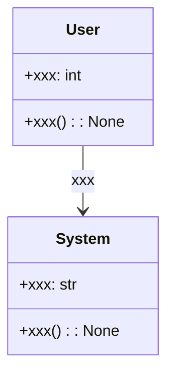

# Issue`xxx`の仕様書

## 1. 目次
- [1. 目次](#1-目次)
- [2. 用語](#2-用語)
- [3. 依頼内容](#3-依頼内容)
- [4. 機能要件/非機能要件](#4-機能要件非機能要件)
  - [4.1. 機能要件](#41-機能要件)
  - [4.2. 非機能要件](#42-非機能要件)
- [5. 使用ツール/ライブラリ](#5-使用ツールライブラリ)
- [6. クラス設計](#6-クラス設計)
  - [6.1. `Xxx`クラス(新規)](#61-xxxクラス新規)
- [7. UML](#7-uml)
  - [ユースケース図](#ユースケース図)
  - [7.1. シーケンス図](#71-シーケンス図)
  - [7.2. クラス図](#72-クラス図)
- [8. タスク](#8-タスク)
  - [8.1. (補足)本セクションの説明](#81-補足本セクションの説明)

## 2. 用語
- notiontaskr: 本プロジェクトの名称
-  

## 3. 依頼内容
- issue番号: 123
- タイトル: 〇〇機能の実装
- 内容: 
  - 〇〇機能を実装してください。
  - 〇〇機能の実装にあたっては、以下の点に注意してください。
    - 〇〇
    - 〇〇
    - 〇〇

## 4. 機能要件/非機能要件
### 4.1. 機能要件
- 〇〇できること
- xxxできること
### 4.2. 非機能要件
- xx以内に実行されること

## 5. 使用ツール/ライブラリ
- xxx api
- xxx ライブラリ

## 6. クラス設計
### 6.1. `Xxx`クラス(新規)
#### 格納場所
- `src/xxx/xxx.py`
#### メソッド: 
- `xxx: int`
  - 説明: xxxをおこなうためのxxx
- `xxx: str`

#### メンバ:
- `xxx() -> None`
  - 説明: 
    - xxxをおこなうxxxメソッドを実装する
    - メンバにはxxやxxを実装する
    - xxインターフェースを継承する
- `xxx() -> None`

#### テストケース
- 正常系:
  - `xxx`メソッドの正常系テスト
    - 入力: xxx
    - 期待値: xxx
- 異常系:
  - `xxx`メソッドの異常系テスト
    - 入力: xxx
    - 期待値: xxx

## 7. UML
### ユースケース図

### 7.1. シーケンス図

### 7.2. クラス図

## 8. タスク
- [ ] メインタスク1(2h)
  - [ ] サブタスク1(1h)
    - 実装内容1
    - 実装内容2
  - [ ] サブタスク2(1h)
    - 実装内容1
    - 実装内容2
- [ ] メインタスク2(1h)
  - [ ] サブタスク1(1h)

### 8.1. (補足)本セクションの説明
- 各タスクには、以下の内容を記載します。
  - タスクの内容
  - タスクの人時工数(例: 1h)
    - 人時工数は、あくまで目安であり、推測されるコーディング量などから算出してください。 
- メインタスクには、主に以下の内容を記載します。
  - 依頼内容の要件を大まかに分解したもの
  - 分解はこの段階では細かくしすぎないこと
  - (例: -[ ] 〇〇機能の実装(1h))
- サブタスクには、主に以下の内容を記載します。
  - メインタスクをより細かく分解したもの
  - クラスやメソッド実装のレベルまで分解する
  - (例: -[ ] 〇〇クラスの実装(1h))
- 実装内容には、自由形式でクラス内部のメンバやメソッドについて記載します。
  - (例: -[ ] 〇〇メソッドの実装(1h))
    - xxをおこなうxxメソッドを実装する
    - メンバにはxxやxxを実装する
    - xxインターフェースを継承する

#### (補足)記載例
- [ ] 〇〇機能の実装(1h)
  - [ ] 〇〇クラスの実装(1h)
    - 〇〇クラスを実装する
    - メンバには、〇〇や〇〇を実装する
    - 〇〇インターフェースを継承する

